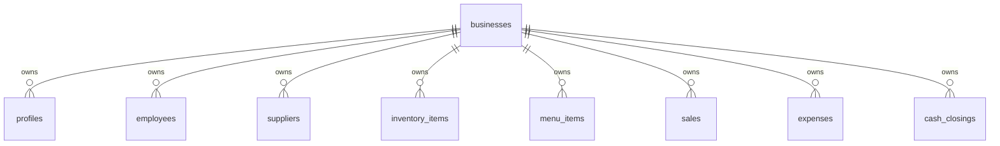
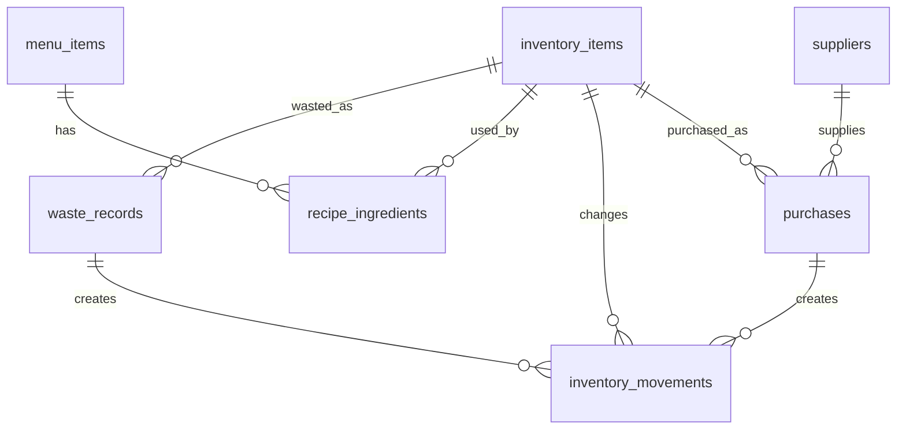
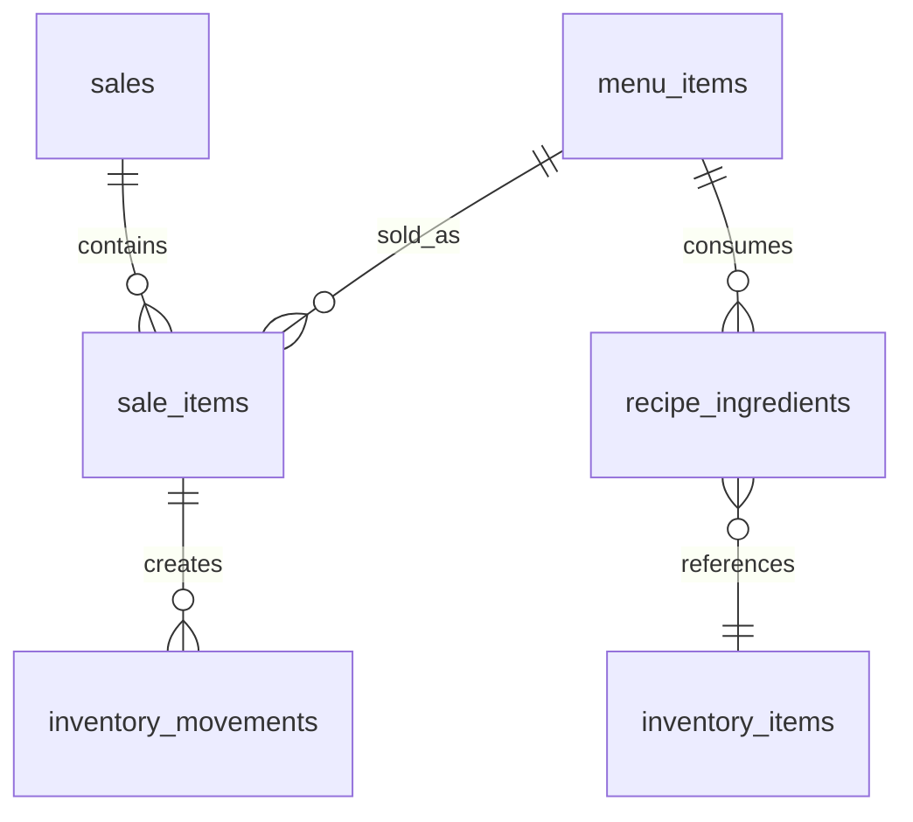
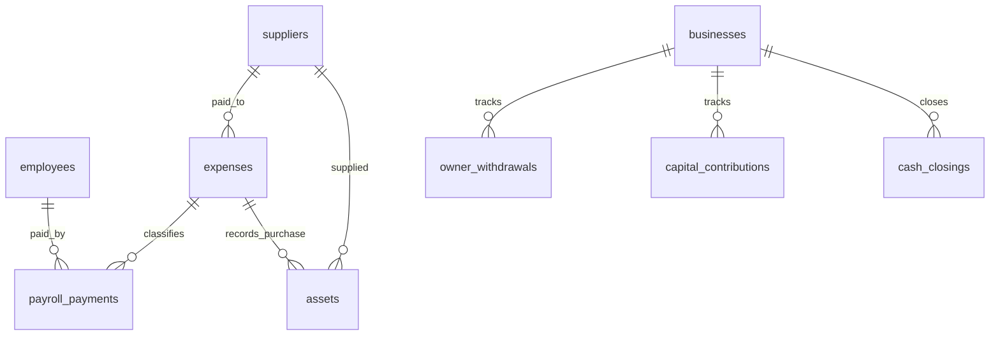

# Kfeteria Database Plan

## How to use this document

This document is the authoritative planning reference for the Kfeteria database model. It defines the planned tables, relationships, business rules, costing rules, inventory flows, sales flows, security notes, and future scalability direction.

This is a planning document only. Do not treat it as a migration file.

Use this document together with:

- `docs/PROJECT_CONTEXT.md`
- `docs/DESIGN_GUIDE.md`
- `docs/DEVELOPMENT_RULES.md`

## Database goals

The database should help Kfeteria:

- Track inventory quantities and costs accurately.
- Preserve a full history of inventory movements.
- Calculate menu item cost from recipes and inventory item costs.
- Record sales and sale line items clearly.
- Separate sales, operating expenses, payroll, owner withdrawals, capital contributions, and assets.
- Support day-end cash closing.
- Support reporting for profit, waste, low stock, purchases, and cash.
- Prepare for future multi-business support without overcomplicating the first Kfeteria-focused version.

## Planned tables

The currently planned tables are:

- `businesses`
- `profiles`
- `employees`
- `inventory_items`
- `purchases`
- `inventory_movements`
- `menu_items`
- `recipe_ingredients`
- `sales`
- `sale_items`
- `expenses`
- `payroll_payments`
- `owner_withdrawals`
- `capital_contributions`
- `assets`
- `waste_records`
- `cash_closings`
- `suppliers`

## Shared conventions

Most business-owned tables should include:

- `id`: primary key.
- `business_id`: references `businesses.id`.
- `created_at`: timestamp.
- `updated_at`: timestamp.
- `created_by`: optional reference to `profiles.id` for auditability.

Recommended ID strategy:

- Use UUID primary keys.
- Use Supabase Auth user IDs for `profiles.id` when the profile represents an authenticated user.

Recommended money strategy:

- Store money in integer minor units when possible, such as cents.
- If using decimal values, use fixed precision numeric columns and avoid floating-point types.
- Store currency explicitly if multi-currency support becomes necessary.
- Kfeteria can initially assume Dominican pesos, displayed as `RD$`.

Recommended quantity strategy:

- Store quantities as fixed precision numeric values.
- Always store the unit context.
- Never rely on unit meaning being implied by UI labels.

## Enums

Enums may be implemented as PostgreSQL enum types, constrained text columns, or lookup tables. PostgreSQL enum types are simple and type-safe, but lookup tables are easier to extend later. For the first version, constrained text or enums are acceptable.

### `role`

Suggested values:

- `admin`
- `employee`

Rules:

- `admin` can manage sensitive business configuration, recipes, prices, employees, payroll, reports, owner movements, capital contributions, and assets.
- `employee` can register sales, purchases, expenses, waste, view inventory, view menu, and perform cash closing.
- Role checks must be enforced with Row Level Security and application-level guards.

### `payment_method`

Suggested values:

- `cash`
- `card`
- `transfer`
- `mobile_payment`
- `credit`
- `mixed`

Rules:

- Sales and cash closings should preserve payment method details.
- `mixed` should be supported when a transaction uses more than one method.
- Cash closing calculations should only include cash payments in expected cash.

### `expense_type`

Suggested values:

- `rent`
- `utilities`
- `supplies`
- `maintenance`
- `transport`
- `marketing`
- `payroll`
- `tax`
- `asset_purchase`
- `other`

Rules:

- Payroll payments should create or link to expense records with `expense_type = payroll`.
- Asset purchases should remain distinguishable from ordinary operating expenses.
- Owner withdrawals must not be recorded as expenses.
- Capital contributions must not be recorded as sales or income.

### `movement_type`

Suggested values:

- `purchase`
- `sale_consumption`
- `waste`
- `adjustment_in`
- `adjustment_out`
- `return_in`
- `return_out`
- `initial_stock`

Rules:

- Every inventory quantity change should create an `inventory_movements` record.
- `purchase`, `adjustment_in`, `return_in`, and `initial_stock` increase inventory.
- `sale_consumption`, `waste`, `adjustment_out`, and `return_out` decrease inventory.
- Sales should consume inventory through recipe relationships when available.

### `item_type`

Suggested values:

- `countable`
- `weight`
- `liquid`
- `package`

Rules:

- The item type determines which base units are valid.
- Inventory display must always include the unit.

### `base_unit`

Suggested values:

- `unit`
- `lb`
- `kg`
- `oz`
- `liter`
- `ml`
- `gallon`
- `package`
- `bottle`

Rules:

- Recipe ingredient quantities must use the inventory item's base unit.
- Inventory movements should use the inventory item's base unit unless a conversion system is explicitly added.

### `contribution_type`

Suggested values:

- `cash`
- `equipment`
- `inventory`
- `other`

Rules:

- Capital contributions are not sales.
- Capital contributions are not profit.
- Cash contributions increase available business capital or cash position.

### `salary_type`

Suggested values:

- `hourly`
- `daily`
- `weekly`
- `biweekly`
- `monthly`
- `commission`

Rules:

- Employee salary type must be explicit.
- Payroll reporting should not infer pay period from amount alone.

### Additional recommended enums

#### `sale_status`

Suggested values:

- `completed`
- `voided`
- `refunded`

#### `purchase_status`

Suggested values:

- `completed`
- `cancelled`

#### `cash_closing_status`

Suggested values:

- `open`
- `closed`
- `reviewed`

## Units rules

Supported base units:

- `unit`: individual countable items, such as bread slices or eggs.
- `lb`: pounds, commonly used for ham, cheese, meat, and some bulk items.
- `kg`: kilograms, useful for metric-weight purchases.
- `oz`: ounces, useful for sauces and small weighted quantities.
- `liter`: liters, useful for liquid ingredients.
- `ml`: milliliters, useful for smaller liquid quantities.
- `gallon`: gallons, useful for bulk liquid purchases.
- `package`: packaged goods where the package is the tracked unit.
- `bottle`: bottled goods where each bottle is tracked.

Rules:

- Always display quantities with units, such as `0.10 lb`, `0.50 oz`, or `5 units`.
- Never display raw quantities without unit context.
- Each inventory item has one base unit.
- Recipe ingredients must use the inventory item's base unit.
- Inventory movements should record the base unit used at the time of movement.
- Purchases may record purchase unit details, but inventory should be converted into the item's base unit before affecting stock.
- Unit conversion should be explicit, auditable, and tested before supporting automatic conversions.

Valid item type and base unit examples:

| Item type | Suggested base units |
| --- | --- |
| `countable` | `unit`, `bottle`, `package` |
| `weight` | `lb`, `kg`, `oz` |
| `liquid` | `liter`, `ml`, `gallon`, `bottle` |
| `package` | `package`, `unit`, `bottle` |

## Table plans

### `businesses`

Purpose:

- Represents a cafeteria, restaurant, or food business using the application.
- Provides the root ownership boundary for multi-business data.

Main fields:

- `id`
- `name`
- `legal_name`
- `tax_id`
- `phone`
- `email`
- `address`
- `currency`
- `timezone`
- `is_active`
- `created_at`
- `updated_at`

Relationships:

- Has many `profiles`.
- Has many `employees`.
- Has many inventory, menu, sales, finance, supplier, and closing records.

Important business rules:

- Every business-owned operational record should reference `businesses.id`.
- The first production version can use one business for Kfeteria, but the schema should not assume only one business forever.
- Business-level settings should later live under this ownership boundary.

### `profiles`

Purpose:

- Stores application user profile data linked to Supabase Auth.
- Defines the user's role and business access.

Main fields:

- `id`: matches Supabase Auth user ID.
- `business_id`
- `full_name`
- `email`
- `phone`
- `role`
- `is_active`
- `created_at`
- `updated_at`

Relationships:

- Belongs to `businesses`.
- May be linked to one `employees` record.
- May create records across sales, purchases, expenses, waste, and cash closings through `created_by`.

Important business rules:

- Users only access data for their assigned business.
- Admin users can manage business settings and sensitive finance records.
- Employee users have limited permissions.
- Deactivated profiles should not be able to create new operational records.

### `employees`

Purpose:

- Stores staff records used for operations and payroll.
- Employees may or may not be authenticated application users.

Main fields:

- `id`
- `business_id`
- `profile_id`: nullable reference to `profiles.id`.
- `full_name`
- `position`
- `phone`
- `salary_amount`
- `salary_type`
- `hire_date`
- `termination_date`
- `is_active`
- `created_at`
- `updated_at`

Relationships:

- Belongs to `businesses`.
- Optionally belongs to `profiles`.
- Has many `payroll_payments`.
- May create operational records if linked to a profile.

Important business rules:

- Salary type must be explicit.
- Inactive employees remain in historical payroll records.
- Payroll payments should not be deleted just because an employee becomes inactive.

### `suppliers`

Purpose:

- Stores vendors used for inventory purchases, services, and business expenses.

Main fields:

- `id`
- `business_id`
- `name`
- `contact_name`
- `phone`
- `email`
- `address`
- `notes`
- `is_active`
- `created_at`
- `updated_at`

Relationships:

- Belongs to `businesses`.
- Has many `purchases`.
- May be referenced by `expenses` and `assets`.

Important business rules:

- Supplier records should remain available for historical purchases even if inactive.
- Purchases should preserve supplier context when available.

### `inventory_items`

Purpose:

- Defines stock-tracked items used in purchases, recipes, waste, and inventory reports.

Main fields:

- `id`
- `business_id`
- `name`
- `sku`
- `item_type`
- `base_unit`
- `current_quantity`
- `average_unit_cost`
- `low_stock_threshold`
- `is_active`
- `created_at`
- `updated_at`

Relationships:

- Belongs to `businesses`.
- Has many `purchases`.
- Has many `inventory_movements`.
- Has many `recipe_ingredients`.
- Has many `waste_records`.

Important business rules:

- `current_quantity` should match the sum of inventory movements.
- `average_unit_cost` should update after purchases and inventory value adjustments.
- Base unit must be explicit and stable.
- Recipe quantities must use this item's base unit.
- Items should be deactivated instead of deleted when used historically.

### `purchases`

Purpose:

- Records inventory purchases and their cost basis.
- Adds stock to inventory and creates inventory movement history.

Main fields:

- `id`
- `business_id`
- `supplier_id`
- `inventory_item_id`
- `purchase_date`
- `quantity`
- `unit`
- `unit_cost`
- `total_cost`
- `payment_method`
- `status`
- `notes`
- `created_by`
- `created_at`
- `updated_at`

Relationships:

- Belongs to `businesses`.
- Belongs to `suppliers`.
- Belongs to `inventory_items`.
- Creates one or more `inventory_movements`.

Important business rules:

- Completed purchases increase inventory.
- Purchases affect inventory cost basis.
- Purchases are not sales.
- Purchases should preserve quantity, unit, total cost, supplier, date, and creator.
- Cancelled purchases should not affect current inventory.

### `inventory_movements`

Purpose:

- Stores every inventory quantity change.
- Provides auditability for stock levels, costing, waste, purchases, and sale consumption.

Main fields:

- `id`
- `business_id`
- `inventory_item_id`
- `movement_type`
- `quantity`
- `unit`
- `unit_cost_at_time`
- `total_cost_at_time`
- `source_table`
- `source_id`
- `occurred_at`
- `notes`
- `created_by`
- `created_at`

Relationships:

- Belongs to `businesses`.
- Belongs to `inventory_items`.
- Can be sourced by `purchases`, `sale_items`, `waste_records`, or manual adjustments.

Important business rules:

- Positive movement types increase stock.
- Negative movement types decrease stock.
- Sales reduce stock through `sale_consumption`.
- Waste reduces stock through `waste`.
- Movement records should be append-only where possible.
- Corrections should generally use adjustment movements instead of editing history.

### `menu_items`

Purpose:

- Defines products sold to customers.
- Stores pricing and current sale availability.

Main fields:

- `id`
- `business_id`
- `name`
- `description`
- `category`
- `sale_price`
- `estimated_cost`
- `estimated_profit`
- `estimated_margin_percent`
- `is_active`
- `created_at`
- `updated_at`

Relationships:

- Belongs to `businesses`.
- Has many `recipe_ingredients`.
- Has many `sale_items`.

Important business rules:

- Menu items can be sold only when active.
- Cost should be derived from recipe ingredients and current inventory costs.
- Price changes should not rewrite historical sales.
- Estimated cost and margin may be cached for performance, but source of truth is the recipe and inventory cost rules.

### `recipe_ingredients`

Purpose:

- Defines the inventory quantities consumed when a menu item is sold.

Main fields:

- `id`
- `business_id`
- `menu_item_id`
- `inventory_item_id`
- `quantity`
- `unit`
- `created_at`
- `updated_at`

Relationships:

- Belongs to `businesses`.
- Belongs to `menu_items`.
- Belongs to `inventory_items`.

Important business rules:

- Ingredient `unit` must match the inventory item's `base_unit` unless explicit conversions exist.
- Ingredient quantities must be human-readable and precise.
- A sale of a menu item consumes each recipe ingredient multiplied by the quantity sold.
- Recipes should not modify historical sale costs after a sale is completed.

### `sales`

Purpose:

- Records customer transactions.
- Provides the header record for one or more sale items.

Main fields:

- `id`
- `business_id`
- `sale_date`
- `subtotal`
- `discount_total`
- `tax_total`
- `total`
- `payment_method`
- `cash_received`
- `change_given`
- `status`
- `estimated_cost`
- `estimated_profit`
- `notes`
- `created_by`
- `created_at`
- `updated_at`

Relationships:

- Belongs to `businesses`.
- Has many `sale_items`.
- May be included in one `cash_closings` period.

Important business rules:

- Sales are revenue.
- Sales consume inventory through recipe relationships when applicable.
- Completed sales reduce inventory.
- Voided or refunded sales need explicit reversal rules.
- Historical sale totals and estimated costs should remain stable after completion.

### `sale_items`

Purpose:

- Stores each item sold within a sale.
- Preserves quantity, price, and cost snapshot at sale time.

Main fields:

- `id`
- `business_id`
- `sale_id`
- `menu_item_id`
- `quantity`
- `unit_price`
- `line_total`
- `estimated_unit_cost`
- `estimated_total_cost`
- `estimated_profit`
- `created_at`

Relationships:

- Belongs to `businesses`.
- Belongs to `sales`.
- Belongs to `menu_items`.
- Creates inventory movements through recipe consumption.

Important business rules:

- Unit price should be copied from the menu item at sale time.
- Estimated cost should be copied or calculated at sale time.
- Later recipe, inventory cost, or menu price changes must not rewrite historical sale item values.

### `expenses`

Purpose:

- Records ordinary operating expenses and certain classified finance costs.

Main fields:

- `id`
- `business_id`
- `expense_date`
- `expense_type`
- `supplier_id`
- `description`
- `amount`
- `payment_method`
- `receipt_url`
- `notes`
- `created_by`
- `created_at`
- `updated_at`

Relationships:

- Belongs to `businesses`.
- Optionally belongs to `suppliers`.
- May be linked from `payroll_payments`.
- May be linked from `assets` for asset purchase tracking.

Important business rules:

- Operating expenses reduce estimated profit reports.
- Payroll is represented separately through `payroll_payments` but may create or link to an expense entry.
- Owner withdrawals must not be stored as expenses.
- Capital contributions must not be stored as expenses or sales.

### `payroll_payments`

Purpose:

- Records payments made to employees.
- Keeps payroll distinct while still supporting expense reporting.

Main fields:

- `id`
- `business_id`
- `employee_id`
- `expense_id`
- `pay_period_start`
- `pay_period_end`
- `payment_date`
- `salary_type`
- `amount`
- `payment_method`
- `notes`
- `created_by`
- `created_at`
- `updated_at`

Relationships:

- Belongs to `businesses`.
- Belongs to `employees`.
- Optionally belongs to `expenses`.

Important business rules:

- Payroll payments should create or link to an expense record with `expense_type = payroll`.
- Payroll must remain reportable by employee and pay period.
- Historical payroll records must preserve salary type and amount at payment time.

### `owner_withdrawals`

Purpose:

- Records money or value withdrawn by owners from the business.

Main fields:

- `id`
- `business_id`
- `withdrawal_date`
- `amount`
- `payment_method`
- `reason`
- `notes`
- `created_by`
- `created_at`
- `updated_at`

Relationships:

- Belongs to `businesses`.
- Created by `profiles`.

Important business rules:

- Owner withdrawals are not operating expenses.
- Owner withdrawals are not cost of goods sold.
- Owner withdrawals reduce available cash or capital position.
- Reports must keep owner withdrawals separate from profit calculations.

### `capital_contributions`

Purpose:

- Records owner or investor contributions into the business.

Main fields:

- `id`
- `business_id`
- `contribution_date`
- `contribution_type`
- `amount`
- `description`
- `payment_method`
- `notes`
- `created_by`
- `created_at`
- `updated_at`

Relationships:

- Belongs to `businesses`.
- Created by `profiles`.

Important business rules:

- Capital contributions are not sales.
- Capital contributions are not revenue.
- Capital contributions are not profit.
- Cash contributions increase cash or business capital position.
- Non-cash contributions should preserve description and estimated value.

### `assets`

Purpose:

- Tracks business assets such as equipment, furniture, and appliances.

Main fields:

- `id`
- `business_id`
- `supplier_id`
- `expense_id`
- `name`
- `category`
- `purchase_date`
- `purchase_value`
- `estimated_current_value`
- `useful_life_months`
- `condition`
- `notes`
- `is_active`
- `created_at`
- `updated_at`

Relationships:

- Belongs to `businesses`.
- Optionally belongs to `suppliers`.
- Optionally belongs to `expenses`.

Important business rules:

- Assets are distinct from inventory items.
- Asset purchases should be distinguishable from normal operating expenses.
- Depreciation is informational for reporting.
- Depreciation must not affect daily profit calculations unless a later accounting module explicitly supports it.

### `waste_records`

Purpose:

- Records inventory lost without being sold.
- Supports waste reporting and estimated loss calculation.

Main fields:

- `id`
- `business_id`
- `inventory_item_id`
- `waste_date`
- `quantity`
- `unit`
- `estimated_unit_cost`
- `estimated_total_loss`
- `reason`
- `notes`
- `created_by`
- `created_at`
- `updated_at`

Relationships:

- Belongs to `businesses`.
- Belongs to `inventory_items`.
- Creates one `inventory_movements` record with `movement_type = waste`.

Important business rules:

- Waste is not a sale.
- Waste reduces inventory.
- Waste should preserve quantity, unit, reason, estimated loss, and creator.
- Waste reports should help identify recurring loss patterns.

### `cash_closings`

Purpose:

- Records day-end or shift-end cash closing results.
- Compares expected cash with counted cash.

Main fields:

- `id`
- `business_id`
- `closing_date`
- `period_start`
- `period_end`
- `expected_cash`
- `counted_cash`
- `difference`
- `cash_sales_total`
- `cash_expenses_total`
- `cash_withdrawals_total`
- `cash_contributions_total`
- `status`
- `notes`
- `created_by`
- `reviewed_by`
- `created_at`
- `updated_at`

Relationships:

- Belongs to `businesses`.
- Created by `profiles`.
- Reviewed by `profiles`.
- Summarizes sales, cash expenses, owner withdrawals, and capital contributions for a period.

Important business rules:

- Expected cash should include cash sales and cash capital contributions.
- Expected cash should subtract cash expenses and cash owner withdrawals.
- Non-cash payment methods should not increase expected physical cash.
- A closing should define a clear time period.
- Closed cash closings should be editable only by admins or through a controlled correction flow.

## Relationship diagrams

### Business ownership



### Inventory, purchase, recipe, and waste



### Sales and inventory consumption



### Finance



## Inventory flow examples

### Purchase inventory

Example:

- Purchase `100 lb` rice.
- Total cost: `RD$3,700`.
- Unit cost: `RD$37.00 per lb`.

Expected database behavior:

1. Create a `purchases` record.
2. Create an `inventory_movements` record:
   - `movement_type = purchase`
   - `quantity = 100`
   - `unit = lb`
   - `unit_cost_at_time = 37.00`
   - `total_cost_at_time = 3700.00`
3. Increase `inventory_items.current_quantity` by `100 lb`.
4. Recalculate `inventory_items.average_unit_cost`.

Average cost example:

- Existing quantity: `50 lb`.
- Existing average cost: `RD$35.00 per lb`.
- Existing inventory value: `RD$1,750`.
- New purchase: `100 lb` at `RD$37.00 per lb`.
- New inventory value: `RD$1,750 + RD$3,700 = RD$5,450`.
- New quantity: `150 lb`.
- New average cost: `RD$36.33 per lb`.

### Manual adjustment in

Example:

- Count finds `5 units` more bread than expected.

Expected database behavior:

1. Create an `inventory_movements` record with `movement_type = adjustment_in`.
2. Increase `inventory_items.current_quantity`.
3. Preserve note explaining the adjustment reason.

### Manual adjustment out

Example:

- Count finds `3 bottles` missing.

Expected database behavior:

1. Create an `inventory_movements` record with `movement_type = adjustment_out`.
2. Decrease `inventory_items.current_quantity`.
3. Preserve note explaining the adjustment reason.

### Waste

Example:

- `2 units` of bread are damaged.

Expected database behavior:

1. Create a `waste_records` record.
2. Create an `inventory_movements` record with `movement_type = waste`.
3. Decrease `inventory_items.current_quantity` by `2 units`.
4. Calculate estimated loss from current average unit cost.

## Sales flow examples

### Sale of one menu item

Example recipe: ham and cheese toast.

- Bread: `1 unit`
- Ham: `0.10 lb`
- Cheese: `0.10 lb`
- Ketchup: `0.50 oz`
- Mayonnaise: `0.50 oz`

Example sale:

- Sell `2` ham and cheese toasts.

Expected database behavior:

1. Create a `sales` record.
2. Create a `sale_items` record for `2` toasts.
3. Calculate inventory consumption:
   - Bread: `2 units`
   - Ham: `0.20 lb`
   - Cheese: `0.20 lb`
   - Ketchup: `1.00 oz`
   - Mayonnaise: `1.00 oz`
4. Create `inventory_movements` records with `movement_type = sale_consumption` for each ingredient.
5. Decrease each `inventory_items.current_quantity`.
6. Store estimated cost and estimated profit snapshots on `sale_items` and `sales`.

### Cash sale

Example:

- Sale total: `RD$300`.
- Payment method: `cash`.
- Customer gives: `RD$500`.
- Change: `RD$200`.

Expected database behavior:

1. `sales.total = 300`.
2. `sales.payment_method = cash`.
3. `sales.cash_received = 500`.
4. `sales.change_given = 200`.
5. Cash closing expected cash increases by `RD$300`, not by `RD$500`.

### Mixed payment sale

Example:

- Sale total: `RD$500`.
- Customer pays `RD$300` cash and `RD$200` card.

Expected database behavior:

1. `sales.payment_method = mixed`.
2. Initial version may store notes or simple payment detail fields.
3. Future version should add a dedicated sale payments table if mixed payment reporting becomes important.
4. Cash closing expected cash increases by `RD$300` only.

## Cost calculation rules

### Inventory average cost

Inventory average cost should be calculated using weighted average cost:

```text
new_average_unit_cost =
  (existing_quantity * existing_average_unit_cost + purchased_quantity * purchase_unit_cost)
  / (existing_quantity + purchased_quantity)
```

Rules:

- Purchase cost updates average unit cost.
- Sale consumption does not update average unit cost.
- Waste does not update average unit cost.
- Manual adjustments should not update average cost unless explicitly marked as value adjustments.
- Average cost should never use floating-point arithmetic.

### Recipe cost

Recipe cost should be calculated from ingredient quantities and current average unit costs:

```text
recipe_cost =
  sum(recipe_ingredient.quantity * inventory_item.average_unit_cost)
```

Rules:

- Ingredient quantity must be in the inventory item's base unit.
- Recipe cost should be recalculated when ingredient costs change.
- Cached `menu_items.estimated_cost` is acceptable but should be refreshed after relevant inventory cost changes.

### Sale item cost

Sale item estimated cost:

```text
sale_item_estimated_unit_cost = menu_item_recipe_cost_at_sale_time
sale_item_estimated_total_cost = sale_item_estimated_unit_cost * sale_item.quantity
sale_item_estimated_profit = sale_item.line_total - sale_item_estimated_total_cost
```

Rules:

- Sale cost should be stored as a snapshot at sale time.
- Historical sale profitability should not change when future inventory purchases change average cost.
- Discounts should reduce revenue before profit is calculated.

### Gross profit

Estimated gross profit:

```text
estimated_gross_profit = sales_total - estimated_cost_of_goods_sold
```

Rules:

- Cost of goods sold comes from sale item estimated costs.
- Waste is reported separately as estimated loss.
- Operating expenses reduce operating profit, not gross profit.

### Operating profit

Estimated operating profit:

```text
estimated_operating_profit =
  sales_total
  - estimated_cost_of_goods_sold
  - operating_expenses
  - payroll_expenses
```

Rules:

- Owner withdrawals are excluded from operating expenses.
- Capital contributions are excluded from sales and profit.
- Asset depreciation is informational unless a future accounting module changes this.

## Cash closing rules

Expected cash for a period:

```text
expected_cash =
  cash_sales_total
  + cash_capital_contributions_total
  - cash_expenses_total
  - cash_owner_withdrawals_total
```

Difference:

```text
difference = counted_cash - expected_cash
```

Rules:

- Only cash payment method amounts affect physical cash expected.
- Card, transfer, mobile payment, and credit sales should not increase expected physical cash.
- Cash closings should preserve the time period used for calculation.
- Closed cash closings should not silently change if historical records are edited later.

## Row Level Security notes

Supabase Row Level Security should be enabled on all business-owned tables.

Recommended access model:

- A user can read records where `record.business_id` matches their active `profiles.business_id`.
- Admin users can insert, update, and manage most records for their business.
- Employee users can insert operational records allowed by their role, such as sales, purchases, expenses, waste, and cash closings.
- Employee users should not update sensitive settings, recipes, menu prices, payroll, owner withdrawals, capital contributions, or assets unless specifically granted.
- Deactivated profiles should not be allowed to create or update records.

Important RLS details:

- Use `auth.uid()` to find the active profile.
- Policies should check both `business_id` and `is_active`.
- Admin-only policies should check `profiles.role = admin`.
- Employee policies should be narrow and table-specific.
- Avoid relying only on client-side role checks.
- Sensitive finance tables should be admin-only by default:
  - `payroll_payments`
  - `owner_withdrawals`
  - `capital_contributions`
  - `assets`

Future multi-business RLS:

- If one user can belong to multiple businesses later, replace direct `profiles.business_id` with a membership table.
- Until then, direct `business_id` on `profiles` is simpler and matches Kfeteria-first needs.

## TypeScript type generation notes

Supabase types should be generated after migrations exist.

Suggested command pattern:

```bash
supabase gen types typescript --project-id <project-id> --schema public > src/types/supabase.ts
```

Rules:

- Do not handwrite database row types that duplicate generated Supabase types.
- Use generated types for table rows, inserts, and updates.
- Create domain-level TypeScript helpers only when they add application meaning.
- Keep calculation utilities typed separately from UI components.
- Regenerate types after migration changes.
- Commit generated type updates with the migrations that caused them.

Recommended TypeScript usage:

- Use generated table types for Supabase reads and writes.
- Use explicit domain types for UI view models, reports, and calculated summaries.
- Test reusable costing and unit conversion utilities.

## Future scalability notes for multi-business support

Current direction:

- Build for Kfeteria first.
- Keep every operational record scoped by `business_id`.
- Avoid premature SaaS complexity.

Future SaaS direction:

- Add a `business_memberships` table if users need access to multiple businesses.
- Add business-level settings for currency, timezone, tax behavior, and reporting preferences.
- Add subscription, billing, and plan tables only when SaaS commercialization begins.
- Add branch or location tables if a business operates multiple cafeterias.
- Add dedicated payment detail tables if mixed payments, payment reconciliation, or accounting exports become important.
- Add category tables if inventory, menu, expenses, and assets need user-managed taxonomies.
- Add audit log tables if regulatory or admin traceability needs exceed simple `created_by` fields.

Multi-business principles:

- No business-owned table should rely on global uniqueness except primary keys.
- Names, SKUs, categories, and supplier names should be unique per business only if uniqueness is needed.
- Reports must always filter by business.
- Storage paths should include `business_id` for uploaded receipts or asset files.

## Future table candidates

These are not part of the current planned table list, but may be added later:

- `business_memberships`
- `business_locations`
- `inventory_categories`
- `menu_categories`
- `expense_categories`
- `sale_payments`
- `audit_logs`
- `receipt_attachments`
- `settings`

Do not create these tables until a feature requires them.

## Summary of document structure

This document is organized as follows:

1. Database goals and shared conventions.
2. The complete current planned table list.
3. Enum recommendations and valid values.
4. Unit rules for inventory, recipes, and display.
5. Detailed table plans with purpose, fields, relationships, and business rules.
6. Markdown relationship diagrams.
7. Inventory flow examples.
8. Sales flow examples.
9. Cost, profit, and cash closing calculation rules.
10. Row Level Security notes.
11. TypeScript type generation notes.
12. Future scalability notes for multi-business support.
